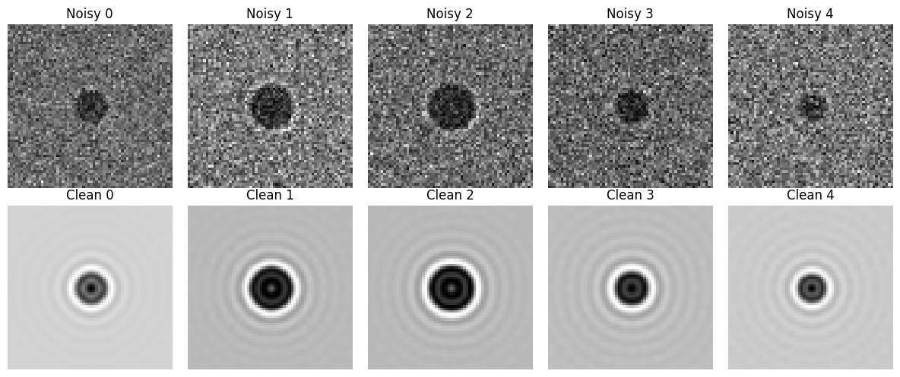
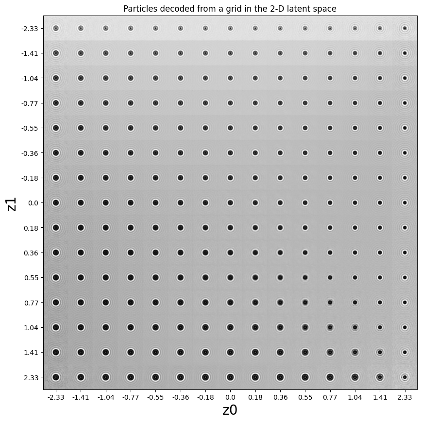
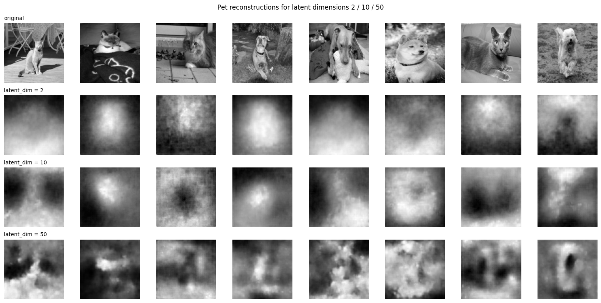
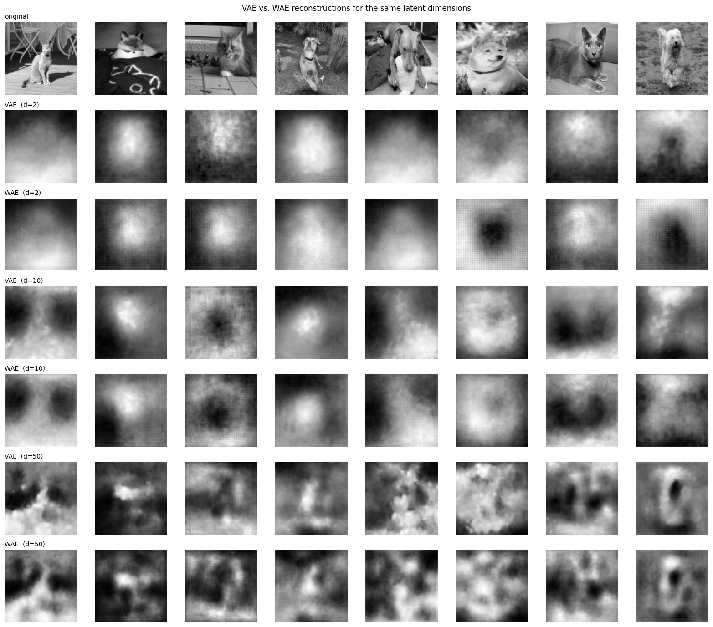
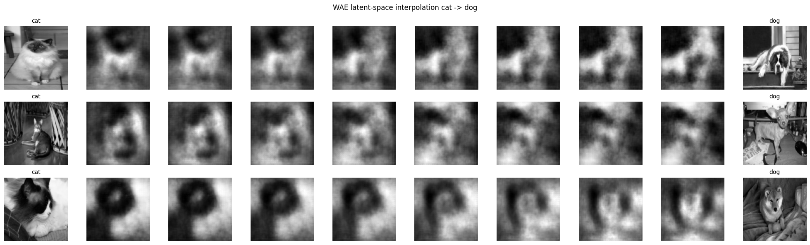
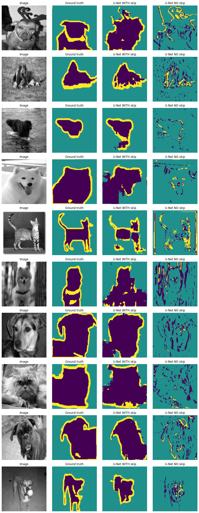

# autoencoders-and-unet

Variational and Wasserstein autoencoders and U-Net segmentation, built with [`deeplay`](https://github.com/DeepTrackAI/deeplay) and [`deeptrack`](https://github.com/DeepTrackAI/DeepTrack2).

## Overview

This repo works through four tasks:

1. **VAE with an MLP bottleneck for denoising**: a fully convolutional denoising autoencoder is replaced with a variational autoencoder, trained on simulated microscopy images of spherical particles. Particle position is fixed at the image center while radius and noise vary, so the compressed latent space can be inspected for how it encodes particle size.
2. **VAE on the Oxford-IIIT Pet dataset**: the same VAE architecture is retrained on grayscale cat/dog images, comparing reconstruction quality and latent-space class separation across latent dimensions 2, 10, and 50.
3. **Wasserstein autoencoder (WAE)**: a WAE is trained on the same pet data and latent dimensions, compared against the VAE reconstructions, including latent-space interpolation between a cat and a dog.
4. **U-Net segmentation** : a U-Net is trained to produce semantic segmentation masks for the pet images, with a second version that removes the skip connections to quantify their contribution via the Jaccard index.

## Contents

```
.
├── Main_Code.ipynb          # Main notebook: all four parts, end to end
└── images/              # Sample outputs used in this README
```

## Setup

```bash
pip install deeplay deeptrack torchmetrics lightning
```

The notebook also expects the [Oxford-IIIT Pet dataset](https://www.robots.ox.ac.uk/~vgg/data/pets/) (`images.tar.gz` and `annotations.tar.gz`) extracted into an `oxford-iiit-pet/` folder in the working directory; the first code cell handles extraction automatically if the archives are present.

## 1 Denoising VAE with a 2D latent space

Simulated brightfield images of spherical particles are used to train a VAE with an MLP bottleneck of size 2.

**Simulated noisy/clean training pairs:**



**Sampling the 2D latent space on a grid:**




## 2 VAE on the Oxford-IIIT Pet dataset

The same architecture is retrained on grayscale pet images at latent dimensions 2, 10, and 50.


**Reconstruction quality across latent dimensions:**




## 3 Wasserstein autoencoder

A WAE is trained on the same data and compared against the VAE.

**WAE vs. VAE reconstructions:**



**Interpolating between a cat and a dog in latent space:**



## 4 U-Net segmentation

A U-Net is trained to segment pet images into trimap classes, then compared against a variant with the skip connections removed.

**Predicted segmentation, with vs. without skip connections:**



## Notes

- Question 1 uses `dt.Sphere` particles imaged with a simulated `dt.Brightfield` microscope, using a fixed-position variant of a variable-position simulation pipeline.
- Question 4 evaluates segmentation quality with the Jaccard index (IoU) on a held-out test set, comparing the standard U-Net against a variant where skip connections are replaced with a no-op module.
